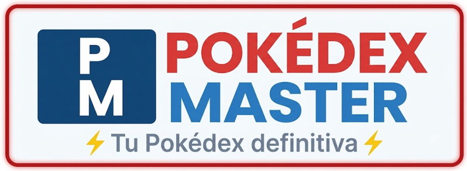
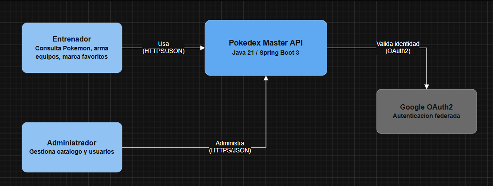
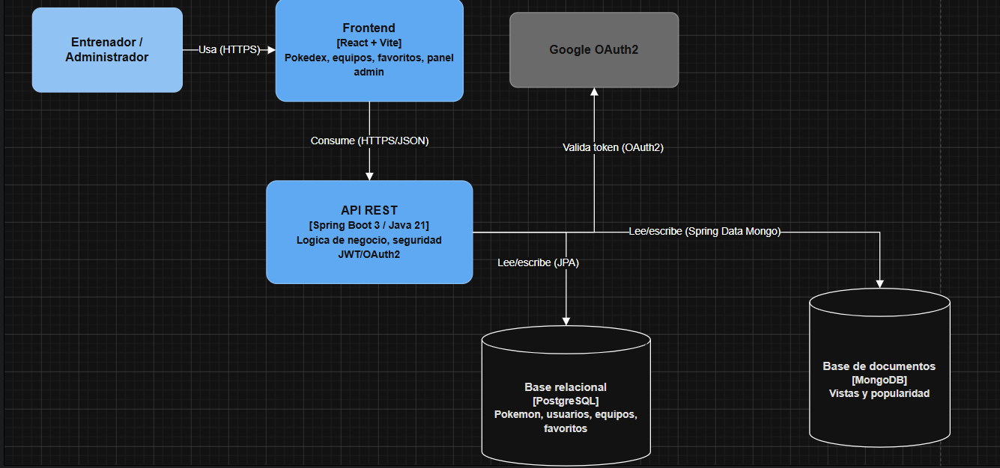
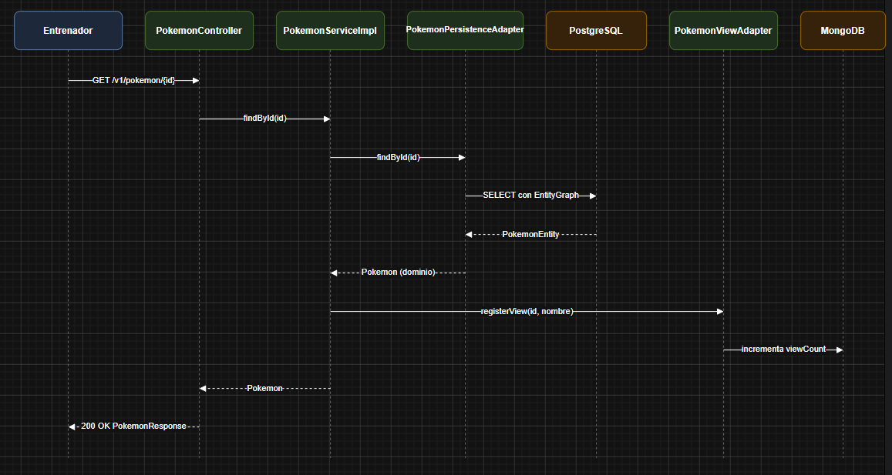
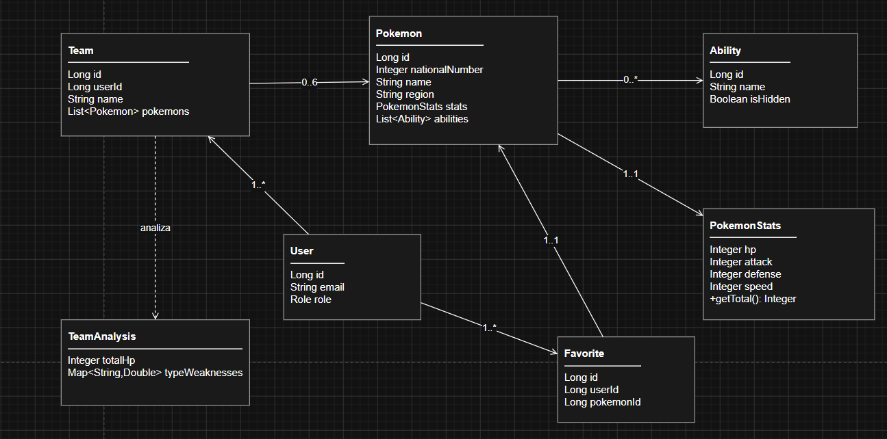

# DOSW-2026-POKEDEX-MASTER-JhonatanMadero
#  POKÉDEX MASTER

------



> **Tu Pokédex definitiva** - Una herramienta completa para entrenadores Pokémon

---

## Descripción

**Pokédex Master** es una aplicación web que simula una Pokédex real, permitiendo a los entrenadores explorar, consultar y gestionar información detallada de Pokémon. Desarrollada como proyecto para la asignatura **DOSW** - Intersemestral 2026.

La aplicación incluye autenticación con Gmail, gestión de perfiles, consulta avanzada de Pokémon con múltiples filtros, sistema de favoritos, creación de equipos, análisis competitivo y panel de administración.

---

## Funcionalidades

### Autenticación y Perfiles
- Registro de nuevos usuarios
- Inicio de sesión con Gmail
- Gestión de perfil personal

### Consulta de Pokémon
- Listado completo con paginación
- Búsqueda por nombre (tiempo real)
- Búsqueda por número de Pokédex
- Vista detallada con estadísticas, habilidades y evolución

### Filtros Avanzados
- Por región (Kanto, Johto, Hoenn, etc.)
- Por tipo primario y secundario
- Por generación
- Por estadísticas base (HP, Atk, Def, etc.)
- Por habilidad
- Por mega evolución
- Por peso

### Favoritos y Equipos
- Guardar Pokémon favoritos
- Crear equipos de hasta 6 Pokémon
- Visualización competitiva del equipo
- Múltiples equipos por usuario

### Estadísticas
- Tasa de elección de Pokémon en equipos
- Cantidad de consultas realizadas
- Ranking de popularidad

### Administración
- CRUD completo de Pokémon
- Gestión de perfiles de usuarios

---

## Identidad Visual

| Elemento | Detalle |
|----------|---------|
| **Nombre** | Pokédex Master |
| **Mascota** | Pokechu (Pikachu con Pokédex) |
| **Colores** | Rojo , Azul , Amarillo  |
| **Tipografía** | Poppins (títulos), Inter (cuerpo) |
| **Estilo** | Moderno con esencia retro Pokémon |

---

##  Enlaces Importantes

| Recurso | Enlace                                                         |
|---------|----------------------------------------------------------------|
| Tablero Jira | [Ver tablero](https://maderojhonatan.atlassian.net/jira/software/projects/D2PJ/boards/101/backlog?atlOrigin=eyJpIjoiNmRhOWE3NDRiNTk4NGU0MGFhOTRjNGQ0MTUyYWIzM2EiLCJwIjoiaiJ9) |
| Prototipo Figma | [Ver prototipo](https://www.figma.com/make/kanGfbscomexC9zlqWYanb/pokedex-master?t=kptebiTcGPCjZ2SI-1)               |
| Documento de Requerimientos | [Ver documento](docs/Analisis_Requerimientos_Pokedex_DOSW.pdf) |
| Manual de Identidad | [ Ver Manual de identidad](docs/Manual%20de%20identidad.pdf)   |


Backend del proyecto **Pokédex Master** (DOSW · 2026 Intersemestral), construido siguiendo la
arquitectura por capas definida en el plan de trabajo (`controller` → `core` → `persistence`,
con `config` y `security` transversales) y cubriendo los requerimientos funcionales y no
funcionales del documento de análisis (RF-01 a RF-22, RNF-01 a RNF-09).

> El **frontend** de este proyecto se entrega como prototipo en Figma (ver README raíz del
> repositorio). Este módulo es exclusivamente el backend.

---

## 1. Stack

Java 21 · Spring Boot 3.3 · PostgreSQL (datos relacionales) · MongoDB (estadísticas de uso) ·
Spring Security 6 + JWT + OAuth2 (Google) · MapStruct · Lombok · Flyway · Springdoc/Swagger ·
JUnit 5 + Mockito · JaCoCo.

## 2. Cómo correrlo

```bash
# 1. Levantar las bases de datos
docker compose up -d

# 2. Variables de entorno (o usar los valores por defecto de application.yml para desarrollo local)
export JWT_SECRET=ZmFrZS1kZXYtc2VjcmV0LWtleS1jaGFuZ2UtbWUtaW4tcHJvZHVjdGlvbi0xMjM0NTY=
export GOOGLE_CLIENT_ID=tu-client-id       # ver seccion 5
export GOOGLE_CLIENT_SECRET=tu-client-secret

# 3. Compilar y correr
mvn clean spring-boot:run
```

La API queda disponible en `http://localhost:8080/api`.
Swagger UI: `http://localhost:8080/api/swagger-ui.html`.

Flyway crea el esquema y carga datos semilla automáticamente (`V1__init_schema.sql`,
`V2__seed_data.sql`): 9 regiones, 12 habilidades y **33 Pokémon representativos de las
generaciones 1 a 3** (Kanto, Johto, Hoenn) elegidos para cubrir todos los filtros de la
Pokédex (varios tipos, mega evoluciones, legendarios, cadenas evolutivas, rangos de stats).

Usuario administrador semilla: `admin@pokedex.com` / `Admin123`.

## 3. Correr las pruebas

```bash
mvn test
mvn jacoco:report   # target/site/jacoco/index.html
```

> **Nota de transparencia:** este código se escribió íntegramente a mano siguiendo la
> especificación del plan de arquitectura, pero no pudo compilarse/ejecutarse en el entorno
> donde se generó (sin acceso a Maven Central). Se revisó cuidadosamente la consistencia de
> imports, firmas y mappers, pero corre `mvn clean compile` y `mvn test` apenas lo bajes para
> cazar cualquier detalle antes de tu entrega.

## 4. Mapeo de Requerimientos → Endpoints

| RF | Descripción | Endpoint |
|----|---|---|
| RF-01 | Registro / login | `POST /v1/auth/register`, `POST /v1/auth/login` |
| RF-02 | Login con Gmail | `GET /oauth2/authorization/google` (redirige a Google; ver sección 5) |
| RF-03 | Listar Pokémon | `GET /v1/pokemon` |
| RF-04 | Buscar por nombre | `GET /v1/pokemon/search?q=` |
| RF-05 | Buscar por número | `GET /v1/pokemon/number/{n}` |
| RF-06 | Detalle de Pokémon | `GET /v1/pokemon/{id}` |
| RF-07..RF-14, RF-22 | Filtros combinables (región, tipo 1/2, generación, stats, habilidad, mega, evolución, peso) | `GET /v1/pokemon/filter?...` |
| RF-15 | Favoritos | `GET/POST /v1/favorites`, `DELETE /v1/favorites/{pokemonId}` |
| RF-16, RF-18 | Crear / listar / editar / borrar equipos | `POST/GET/PUT/DELETE /v1/teams` |
| RF-17 | Análisis competitivo del equipo | `GET /v1/teams/{id}/analysis` |
| RF-19 | Estadísticas de popularidad y tasa de elección | `GET /v1/stats/popularity`, `GET /v1/stats/pick-rate`, `GET /v1/stats/general` |
| RF-20 | CRUD de Pokémon (ADMIN) | `POST/PUT/DELETE /v1/pokemon` |
| RF-21 | Administración de usuarios (ADMIN) | `GET/PATCH/DELETE /v1/admin/users`, `GET/PUT /v1/users/me` |

## 5. OAuth2 con Google (RF-02)

`SecurityConfig` y `OAuth2SuccessHandler` ya están implementados: al volver de Google, el
sistema crea o recupera el usuario y responde con el **JWT propio de la app** (no se reutiliza
el token de Google). Para activarlo necesitas credenciales reales:

1. Crea un proyecto en [Google Cloud Console](https://console.cloud.google.com/) → *APIs y
   servicios* → *Credenciales* → *ID de cliente OAuth 2.0*.
2. Tipo: *Aplicación web*. URI de redirección autorizado:
   `http://localhost:8080/api/login/oauth2/code/google`.
3. Exporta `GOOGLE_CLIENT_ID` y `GOOGLE_CLIENT_SECRET` como variables de entorno.

## 6. Decisiones de diseño y alcance (léelo antes de entregar)

- **Subconjunto de datos**: se sembraron 33 Pokémon reales (Gen 1-3) en vez de los 1025, tal
  como se acordó, para tener una demo funcional sin depender de fuentes externas no accesibles
  desde el entorno de generación. Es trivial ampliar el `V2__seed_data.sql` con más filas del
  mismo formato si necesitas más volumen para la demo.
- **Tipo primario/secundario como columnas explícitas** en vez del `ManyToMany` genérico del
  plan original: los RF-08/RF-09 piden filtrar por tipo primario y secundario de forma
  independiente, lo cual es más simple y eficiente con dos columnas indexadas que con una tabla
  `pokemon_type` genérica.
- **Cadena evolutiva simplificada**: se modela con auto-referencia (`evolves_from_id`,
  `evolves_to_id`) en vez de una tabla de evoluciones aparte, suficiente para RF-06/RF-14 sin
  sobre-modelar para el alcance del curso.
- **Tabla de efectividad de tipos** (`TypeEffectivenessUtil`, usada en RF-17) cubre los tipos
  presentes en el set de datos semilla (Fuego, Agua, Planta, Eléctrico, Normal, Volador,
  Veneno, Psíquico, Hielo, Roca, Tierra). Tipos como Dragón, Fantasma, Lucha no tienen tabla de
  matchups aún — para esos pares el multiplicador por defecto es 1.0 (neutro). Amplíala si tu
  demo necesita más precisión competitiva.
- **N+1**: resuelto con `@EntityGraph` en los repositorios (`PokemonJpaRepository`,
  `TeamJpaRepository`), igual que exige la Sección 11 del plan.
- **JaCoCo**: configurado con el umbral de 70% del plan, pero las pruebas incluidas cubren solo
  los servicios más críticos (`Pokemon`, `Auth`, `Team`) y un controller de ejemplo — te
  recomendamos añadir pruebas para `Favorite`, `User` y `Stats` antes de la entrega final para
  alcanzar el umbral real.
- **Diagramas del README** (Sección 4 del plan: C4 contexto, C4 componentes, flujo específico,
  clases, ER) siguen pendientes — no se generaron aquí porque el plan pide hacerlos en
  Lucidchart/draw.io/Miro como entregable visual separado. Puedo ayudarte a construirlos como
  diagramas Mermaid/SVG si quieres una base de la que partir.

## 7. Diagaramas
**Diagrama de contexto (C4 – Nivel 1)**


**Diagrama de contenedores (C4 – Nivel 2)**


**Flujo de petición**


**Diagrama de clases del dominio**


**Modelo de datos: PostgreSQL + documentos MongoDB**
